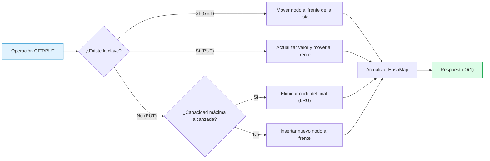
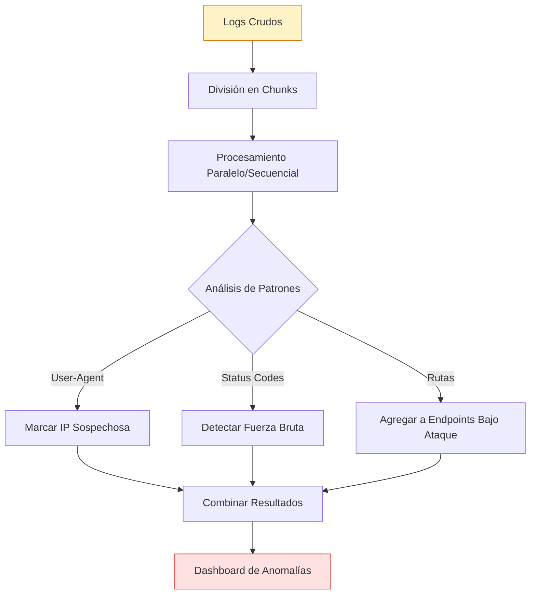

# Algoritmos de Optimización y Análisis

> **📌 Nota:** Este repositorio contiene la implementación de algoritmos de optimización y análisis de datos como parte de la prueba técnica para **Iyata**.  
> 🔗 **Repositorio principal de la prueba:** [test_iyata](https://github.com/MartinCiro/test_iyata)

Una colección de implementaciones algorítmicas en Vanilla JavaScript diseñadas para resolver problemas comunes de rendimiento y seguridad, presentadas a través de una interfaz web interactiva y visual.

---

## 🚀 Características Principales

### 🧠 1. LRU Cache (Least Recently Used)
Implementación de una caché con política de reemplazo LRU, optimizada para operaciones de lectura y escritura en tiempo constante **O(1)**.
- **Operaciones**: `PUT` (insertar/actualizar), `GET` (recuperar y mover al frente), `CLEAR` (vaciar).
- **Suite de Pruebas Automáticas**: Validación de funcionalidad básica, eliminación LRU, actualización de orden, claves inexistentes y capacidad límite.
- **Prueba de Rendimiento**: Ejecución de 10,000+ operaciones masivas con medición de tiempo en milisegundos usando `performance.now()`.
- **Visualización Interactiva**: Representación gráfica en tiempo real del estado interno de la caché (orden de elementos).

### 🔍 2. Analizador de Logs de Seguridad
Algoritmo diseñado para procesar grandes volúmenes de logs (chunking) y detectar patrones de ataque o anomalías en tiempo real.
- **Detección de IPs Sospechosas**: Filtrado basado en patrones de User-Agent (ej. `crawler`, `spider`, `scraper`, `python`, `curl`, `wget`).
- **Identificación de Fuerza Bruta**: Detección de múltiples intentos fallidos desde una misma IP.
- **Endpoints Bajo Ataque**: Agregación y conteo de solicitudes a rutas específicas para identificar picos anómalos.
- **Métricas de Rendimiento**: Tiempo total de análisis y conteo de eventos procesados.

---

## 🏗️ Arquitectura de los Algoritmos

### Flujo del LRU Cache


### Flujo del Analizador de Logs


---

## 💻 Stack Tecnológico

- **Lenguaje**: Vanilla JavaScript (ES6+), sin dependencias externas.
- **Estructura de Datos**: `Map` (para acceso O(1)) y lista doblemente enlazada (para mantener el orden de uso).
- **Interfaz**: HTML5 semántico y CSS3 moderno (Custom Properties / Variables CSS para theming y modo oscuro).
- **Rendimiento**: Uso de `requestAnimationFrame` para actualizaciones de UI no bloqueantes durante pruebas de estrés.

---

## 🛠️ Instalación y Uso

Este proyecto no requiere compilación ni dependencias de Node.js para su ejecución básica, ya que está construido con tecnologías web nativas.

### Opción 1: Ejecución Directa (Recomendada para pruebas rápidas)
1. Clona o descarga el repositorio:
   ```bash
   git clone https://github.com/MartinCiro/algorithms_test.git
   cd algorithms_test
   ```
2. Abre el archivo `index.html` directamente en tu navegador web moderno (Chrome, Firefox, Edge).

### Opción 2: Servidor Local (Recomendada para evitar restricciones CORS)
Si prefieres servirlo localmente (útil si extiendes la funcionalidad):
```bash
# Usando Python 3
python -m http.server 8000

# O usando Node.js (npx)
npx serve .
```
Luego, visita `http://localhost:8000` en tu navegador.

---

## 🧪 Casos de Prueba Incluidos

El módulo de LRU Cache incluye una suite de tests automatizados que validan:
1. **Funcionalidad Básica**: Inserción y recuperación correcta de valores.
2. **Eliminación LRU**: Verificación de que el elemento menos usado es expulsado al superar la capacidad.
3. **Actualización de Orden**: Confirmación de que un `GET` mueve el elemento al frente, protegiéndolo de la eliminación.
4. **Actualización de Claves Existentes**: Modificación de valor sin alterar la capacidad total.
5. **Manejo de Capacidad 1**: Caso borde con caché de un solo elemento.
6. **Limpieza Total**: Validación del método `CLEAR`.

---

## 📂 Estructura del Proyecto

```text
.
├── index.html          # Punto de entrada y estructura de la UI
├── styles.css          # Estilos globales, variables CSS y diseño responsivo
├── script/
│   ├── lru-cache.js    # Implementación de la clase LRUCache y lógica de tests
│   └── log-analyzer.js # Lógica de procesamiento de logs y detección de anomalías
└── README.md           # Este archivo
```

---

## 👤 Autor

**Martin Ciro**  
[](https://github.com/MartinCiro)

---
*Desarrollado como parte de la evaluación técnica para Iyata, enfocándose en la eficiencia algorítmica, la legibilidad del código y la experiencia de usuario.*